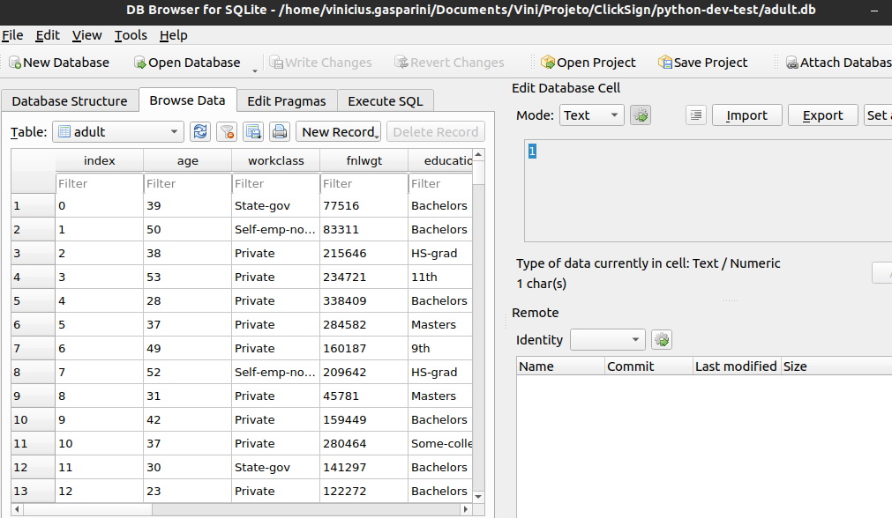
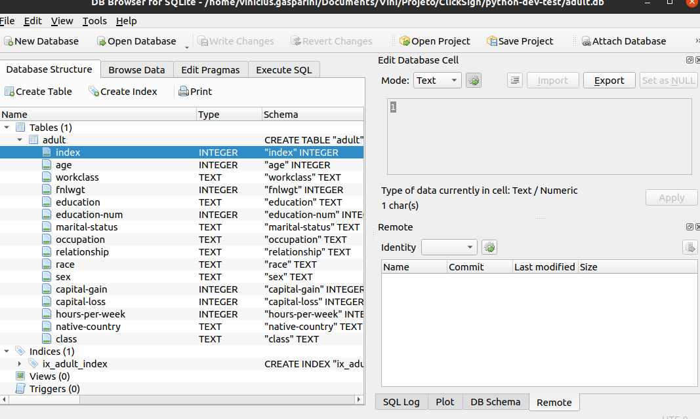
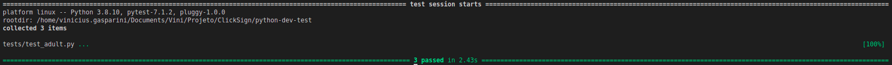

# Datapipeline


### Estrutura

##### - config 
- base_etl - Classe responsável por garantir que toda etl tenha alguns métodos obrigátorio, por exemplo, extract(), tranform(), load(), validate()
- config.py - Classe que contém as configurações para cada ambiente que a etl pode ser executada, por exemplo, prod, hmg, dev
- source.py - Classe que contém todas as propriedades de conexão com as origens de dados, essas propriedades são usadas dentro no método extract() na ETL
- target.py - Classe que contém todas as propriedades de conexão com o destino dos dados, essas propriedades são usadas dentro no método load() na ETL
- utils.py - Classe que contém todas os métodos de transformação dos dados, utilizado dentro no método transform() na ETL

#### - etls
- adult.py - ETL construída conforme o execícío proposto

#### - tests
- test_adult.py - Classe responsável realizar os testes unitários na ETL + data quality utilizando a lib great expectation


### Como executar o projeto

Esse projeto utiliza um gerenciador de pacote chamado **poetry**

1. Entre na pasta do projeto é execute o comando **poetry install** para instalar todas a libs necessárias
```sh
poetry install
```
2. Depois execute o comando para entrar no projeto **poetry shell**
```sh
poetry shell
```
3. Para executar a ETL use o segunte comando **poetry run python -m etls etls.adult.AdultEtl --env=prod**
```sh
poetry run python -m etls etls.adult.AdultEtl --env=prod
```
4. Os testes unitários da ETL podem ser executados com o comando **pytest** no mesmo diretório do projeto
```sh
pytest
```





